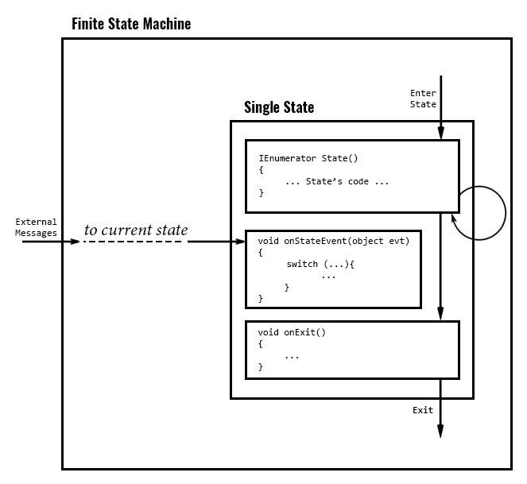

# UnityTFSM

This is demo project of the simple Finate State Machine aproach used in my last project. This is not complete code but just some of important parts which I want to share.



### Events

Event - _is method call with message container as an argument._ All message containers based on same class BaseEvent. The function declaration loks like:

```
void OnEvent(object evt)
{
}
```

In the body of this function we can request type of argument, cast it and use as the data source. The container can be used for storing result of the method as well.

This aproach requre custom dispatching by case switch, but it has ome benefits.

To override the event method for FSM class, use next syntax:

```
public override void OnStateEvent(BaseEvent evt)
{
        switch (...)
        {
                // -- your event handlers
        }
        // -- in other case, to deliver event to curent state
        base.OnStateEvent(evt);
}
```

### Spawning 

Template - _class used for instantiating prefab._ When we create instance of prefab the instance receive message OnSpawned. The message contains refference to template which is located in the scene. The template modify the instance for some exact case. At same time the template can be used by more that one instantiated prefabs.

Instance of the object can be placed to the scene by editor, and anyway initialized by template. In some cases the instance can be used without template.

There are two methods for used by spawning system OnSpawned, OnDespawned. 

```
void OnSpawned(OnSpawnEvent evt)
{
  // Initialize the object. Start FSM if it needs
}

void OnDespawned()
{
  // Deinitialize the object
}
```

After initialization every instance have the pointer to template. Can be used any method of spawning: 

- GameObject.Instantiate
- Custom Objects Pool
- Or just initialization of object class for 3D object already existed in the scene.


### FSM

To make state machine we have to declarate enum with states of it.

```
public enum ElevatorStates
{
    Undefined,
    WaitingState,
    MovingState
}
```

Now can be declarated the behaviour.

```
public class Elevator : TFsmEntity<ElevatorStates>
{
}
```

Now we can declarate the states.

```
public class Elevator : TFsmEntity<ElevatorStates>
{
  IEnumerator WaitingState()
  {
  }
  IEnumerator MovingState()
  {
  }
}
```

Every state body (up to first yield) is onEnter code block. In this block can be declarated onExit finalizer and onEvent handler.

```
IEnumerator WaitingState()
{
  onStateEvent = (BaseEvent evt) =>
  {
  };
  onStateExit = () =>
  {
  };
  
  // onEnter code block
  
  while (...)
  {
    // State arc
    yield
  }
}
```

The state machine control methods

Method | Descrition
-------|-----------
```void StartFsm(STATES initialState, object theValue = null)```|Start FSM with state _initialState_ and argument _theValue_
```object Go(STATES nextState, object theValue = null)```|Start FSM with state _nextState_ and argument _theValue_
```object GoAndStop(STATES nextState, object theValue = null)```|Go to the state _nextState_ with _theValue_ and stop FSM
```object InterruptAndGo(STATES nextState, object theValue = null)```|Same as GO but print the text info about transition to log file
```object GoBack()```|Return to previous state

There is an example how start FSM and how to switch state

```
  public override void OnSpawned(object evt)
  {
    base.OnSpawned(evt);
      StopAllCoroutines();
      
      OnSpawnElevatorEvent e = evt as OnSpawnElevatorEvent;
      template = e.GetTemplate;               // now we can access to template
      
      // initialize character here
      ...
      
      StartFsm(ElevatorStates.WaitingState);  // start FSM here
  }
  IEnumerator MovingState()
  {
    while (stateTime < 1f) 
      yield return null;
    Go(ElevatorStates.WaitingState);
  }
```

Inside state avalabe the next fields

Type|Field|Description
----|-----|-----------
STATE|state|Curent state
STATE|previousState|Previous state
object|stateValue|State's value 
float|stateStartAt|State starts at
float|stateTime|Time since state stars

## Conclusion

In general the aproach works well with simple projects. :)
