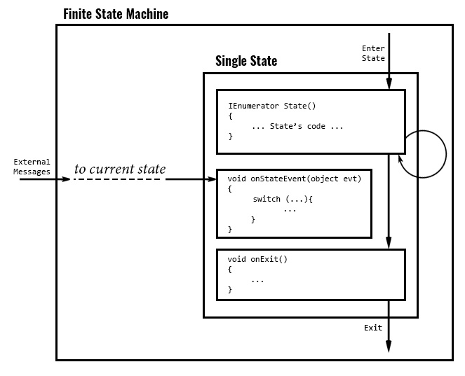

# UnityTFSM

The demo project of the Finite State Machine used in one of my projects. 



### Events

Event handler - _is method with data container as an argument._ All message containers based on same class BaseEvent. The event handler declaration looks like:

```c#
void OnStateEvent(object evt)
{
}
```

The data container can be used for reading input data and storing result of the method as well. The approach requires custom dispatching by case switch statement, but sending message to behaviour will automaticly dispach it to current state. To override the event handler for FSM behaviour, use next syntax:

```c#
public override void OnStateEvent(BaseEvent evt)
{
    switch (...)
    {
        // your event handlers for this behaviour
        ...
        default:
            // in other case, to deliver event to current state
            base.OnStateEvent(evt);
            break;
    }
}
```

### Spawning 

Template - _class is data container used for spawning new game objects._ When new object created the object 's _OnSpawned_ method will be invoked with message container (wich refers to template). 

There are two methods for used by spawning system _OnSpawned_ and _OnDespawned_. 

```c#
void OnSpawned(OnSpawnEvent evt)
{
  // Initialize the object. Start FSM if it needs
  // Copy data from template to this instance
}

void OnDespawned()
{
  // Deinitialize the object
}
```

### FSM

To implement a state machine, define new enum with required states.

```c#
public enum ElevatorStates
{
    Undefined,
    WaitingState,
    MovingState
}
```

Then implement the behavior.

```
public class Elevator : TFsmEntity<ElevatorStates>
{
}
```

Add methods per each available state.

```c#
public class Elevator : TFsmEntity<ElevatorStates>
{
  IEnumerator WaitingState()
  {
  }
  IEnumerator MovingState()
  {
  }
}
```

Every state method's body, starts with onEnter code block. In this block contains definition for onExit and onEvent handler.

```c#
IEnumerator WaitingState()
{
  onStateEvent = (BaseEvent evt) =>
  {
  };
  onStateExit = () =>
  {
  };
  
  // onEnter code block
  
  while (...)
  {
    // State arc
    yield
  }
}
```

Other state machine methods:

Method | Descrition
-------|-----------
```c# void StartFsm(STATES initialState, object theValue = null)```|Start FSM with state _initialState_ and argument _theValue_
object Go(STATES nextState, object theValue = null)|Start FSM with state _nextState_ and argument _theValue_
object GoAndStop(STATES nextState, object theValue = null)|Go to the state _nextState_ with _theValue_ and stop FSM
object InterruptAndGo(STATES nextState, object theValue = null)|Same as GO but print the text info about transition to log file
object GoBack()|Return to previous state

Example starting new FSM and switching a state:

```c#
  public override void OnSpawned(object evt)
  {
      base.OnSpawned(evt);                    // initialize parent class
      StopAllCoroutines();
      
      OnSpawnElevatorEvent e = evt as OnSpawnElevatorEvent;
      template = e.GetTemplate;               // now we can access to template
      // initialize this object here
      this.foo = template.foo;
      this.bar = template.bar;
      ...
      StartFsm(ElevatorStates.WaitingState);  // start FSM here
  }
  IEnumerator MovingState()
  {
    onStateEvent = (BaseEvent evt) =>
    {
      Debug.LogFormat("MovingState.onStateEvent({0})",evt);
    };
    onStateExit = () =>
    {
      Debug.LogFormat("MovingState.onStateExit()");
    };
    while (stateTime < 1f) 
      yield return null;
    Go(ElevatorStates.WaitingState);          // switch FSM state
  }
```

Additionally the FSM has next fields:

Type|Field|Description
----|-----|-----------
STATE|state|Current state
STATE|previousState|Previous state
object|stateValue|State's value 
float|stateStartAt|State starts at
float|stateTime|Time since state stars

## Conclusion

In general the approach works well with simple projects. :)
